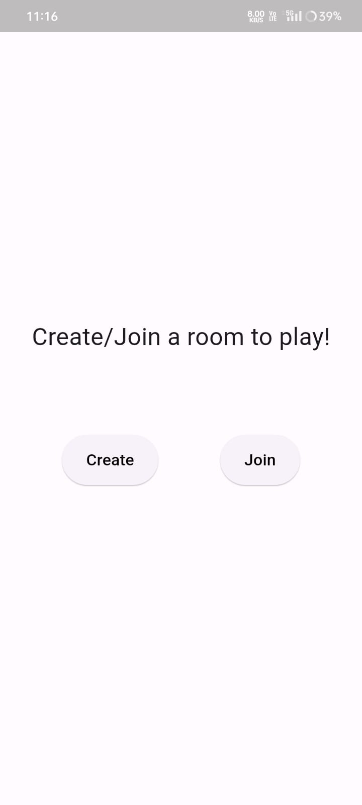
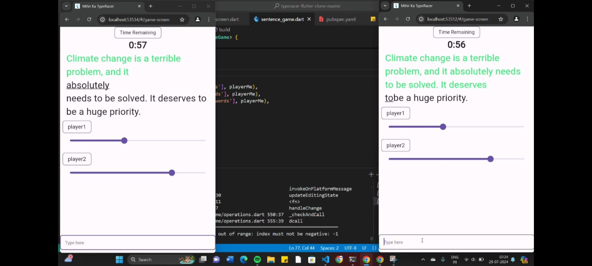

# Typeracer Multiplayer Game

## 🚀 Overview

Brief description of the game, its purpose, and the technologies used.




*Race to type faster than your opponents!*

## 🎮 Features

- **Real-Time Multiplayer**: Compete with friends and other players in real-time.
- **Cross-Platform**: Available on web, Android, and iOS.
- **Smooth UI/UX**: Designed for an engaging and immersive typing experience.

## 📸 Screenshots

Here are some glimpses of the game:


## 🛠️ Technologies Used

- **Flutter**: For building a beautiful and responsive UI.
- **Dart**: For writing efficient and clean code.
- **Socket.IO**: For handling real-time communication between players.

## 🚀 Getting Started

Steps to set up and run the project locally:

1. **Clone the Repository:**

   ```bash
   git clone https://github.com/your-username/typeracer-multiplayer.git
   cd typeracer-multiplayer
